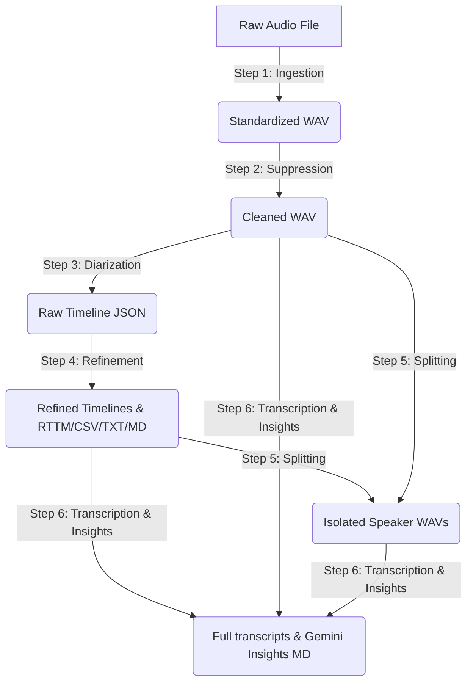

# 🧩 Modular Step-by-Step Speech Processing & Transcription (Atomic Notebooks)

This folder contains a collection of 6 modular, standalone Jupyter notebooks that partition the end-to-end speech-to-text pipeline into isolated execution steps. 

By separating these steps, you can run, test, and debug individual components of the workflow (e.g., just noise suppression, or only speaker splitting) without running the entire pipeline.

---

## 🗺️ Step-by-Step Data Flow

---

## 📥 Input & Output Mappings

| Step / Notebook | Input Folder / File | Output Folder / File |
| :--- | :--- | :--- |
| **01 Ingestion** | `Sample Audio Files/` (e.g., `MarauliKhurad1.m4a`) | `Standardized_Audio/` (e.g., `MarauliKhurad1_standardized.wav`) |
| **02 Suppression** | `Standardized_Audio/` (e.g., `MarauliKhurad1_standardized.wav`) | `Cleaned_Audio/` (e.g., `MarauliKhurad1_cleaned.wav`) |
| **03 Diarization** | `Cleaned_Audio/` (e.g., `MarauliKhurad1_cleaned.wav`) | `Diarization_Outputs/` (e.g., `MarauliKhurad1_raw_timeline.json`) |
| **04 Timeline Refinement** | `Diarization_Outputs/` (e.g., `MarauliKhurad1_raw_timeline.json`) | `Diarization_Outputs/MarauliKhurad1/` (e.g., CSV, JSON, TXT, RTTM, MD reports) |
| **05 Audio Splitting** | `Cleaned_Audio/` + `Diarization_Outputs/MarauliKhurad1/` | `Isolated_Speaker_Audio/MarauliKhurad1/` (e.g., speaker-concatenated tracks & individual turns) |
| **06 Transcription & Insights** | `Cleaned_Audio/` + `Diarization_Outputs/MarauliKhurad1/` | `Diarization_Transcripts/MarauliKhurad1/` (e.g., Gurmukhi transcripts, speaker text, Devanagari reports) |

---

## 📁 Shared Directory Structure

To chain the notebooks together, they are pre-configured to read and write from a single parent folder in Google Drive:
`/content/drive/MyDrive/AnnamAI Tasks/Outreach Activity STT + Question Generation Workflow/Atomic Notebooks/`

Ensure the subdirectories below exist (the notebooks will attempt to create them if missing):
* **`Sample Audio Files/`**: Place your raw audio files here (e.g. `MarauliKhurad1.m4a`).
* **`Standardized_Audio/`**: Contains the resampled 16kHz mono WAV output from Step 1.
* **`Cleaned_Audio/`**: Contains the noise-suppressed WAV output from Step 2.
* **`Diarization_Outputs/`**: Contains the raw and refined timeline CSV, JSON, TXT, and RTTM files from Steps 3 and 4.
* **`Isolated_Speaker_Audio/`**: Contains the speaker-wise split and concatenated WAV files from Step 5.
* **`Diarization_Transcripts/`**: Contains the final chronological transcripts and Devanagari Insights from Step 6.

---

## 🧩 Notebook Overview

### 1. Ingestion & Standardization
* **Notebook**: [01_Audio_Ingestion_and_Standardization.ipynb](01_Audio_Ingestion_and_Standardization.ipynb)
* **Goal**: Resample raw audio files to a standard **16kHz mono WAV** format (required for optimal Pyannote processing).
* **Input**: `Sample Audio Files/[Filename].[extension]`
* **Output**: `Standardized_Audio/[Filename]_standardized.wav`

### 2. Dynamic Noise Suppression
* **Notebook**: [02_Noise_Suppression.ipynb](02_Noise_Suppression.ipynb)
* **Goal**: Adaptively reduce non-stationary background noise using `noisereduce`.
* **Input**: `Standardized_Audio/[Filename]_standardized.wav`
* **Output**: `Cleaned_Audio/[Filename]_cleaned.wav`

### 3. Speaker Diarization
* **Notebook**: [03_Speaker_Diarization.ipynb](03_Speaker_Diarization.ipynb)
* **Goal**: Track who spoke when using the deep-learning-based **Pyannote 4.x community-1** diarization model.
* **Input**: `Cleaned_Audio/[Filename]_cleaned.wav`
* **Output**: `Diarization_Outputs/[Filename]_raw_timeline.json`

### 4. Timeline Refinement & Serialization
* **Notebook**: [04_Timeline_Refinement_and_Serialization.ipynb](04_Timeline_Refinement_and_Serialization.ipynb)
* **Goal**: Clean up the timeline by merging consecutive turns of the same speaker separated by small silence gaps, and output multiple report formats.
* **Input**: `Diarization_Outputs/[Filename]_raw_timeline.json`
* **Output**: Exports five refined files in a `Diarization_Outputs/[Filename]/` subfolder:
  - CSV Timeline (`_timeline.csv`)
  - JSON Timeline (`_timeline.json`)
  - Plain Text Timestamps (`_diarized_timestamps.txt`)
  - Standard RTTM Timeline (`_timeline.rttm`)
  - Premium Markdown Report (`_diarized_report.md`)

### 5. Audio Splitting & Speaker Isolation
* **Notebook**: [05_Audio_Splitting_and_Speaker_Isolation.ipynb](05_Audio_Splitting_and_Speaker_Isolation.ipynb)
* **Goal**: Slice the cleaned audio array and isolate speaker voices (concatenating all turns of the same speaker into a single WAV file) and/or export individual turns.
* **Input**: `Cleaned_Audio/[Filename]_cleaned.wav` and `Diarization_Outputs/[Filename]/[Filename]_timeline.json`
* **Output**: Isolated and concatenated speaker WAV files saved inside `Isolated_Speaker_Audio/[Filename]/`.

### 6. Whisper-LoRA Transcription & Gemini Insights
* **Notebook**: [06_Whisper_Lora_Transcription_and_Gemini_Insights.ipynb](06_Whisper_Lora_Transcription_and_Gemini_Insights.ipynb)
* **Goal**: Transcribe Punjabi speaker segments locally on GPU using a fine-tuned Whisper model + LoRA adapters (`Garden2006/whisper-large-v3-turbo-gurmukhi-lora`). Then, query the Gemini API to transliterate the text into Devanagari and extract structured summary tables, insights, and questions.
* **Input**: Refined timeline JSON + cleaned audio files + Gemini API Key.
* **Output**: Saved inside `Diarization_Transcripts/[Filename]/`:
  - Full Diarized Transcript (`_diarized_transcript.txt`/`.md`/`.json`)
  - Devanagari Translation & Summary Report (`_devanagari_insights.md`)
  - Speaker Segregated Transcripts (`_[Speaker]_transcript.txt`)

---

## 🚀 Setup & Execution

1. Open Google Colab and set your runtime to **GPU** (*Runtime -> Change runtime type -> T4 GPU*), especially for Steps 3 and 6.
2. Open and run each notebook sequentially, adjusting parameters in the Colab form fields.
3. Configure your API credentials (such as your Hugging Face token `HF_TOKEN` for Step 3, and your Gemini API key `GEMINI_API_KEY` for Step 6) in the notebook form fields or Google Colab Secrets (the key 🔑 icon in the sidebar).
