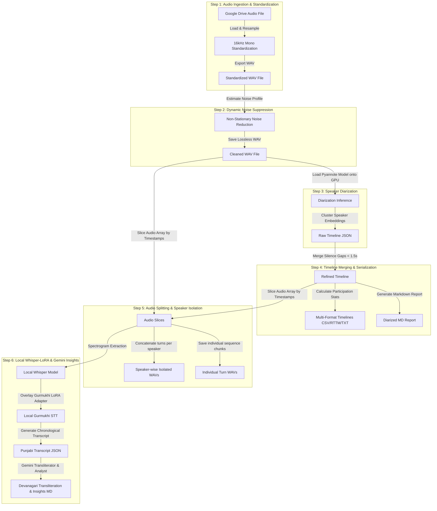

# 🧩 Modular Step-by-Step Speech Processing & Transcription (Atomic Notebooks)

This folder contains a collection of 6 modular, standalone Jupyter notebooks that partition the end-to-end speech-to-text pipeline into isolated execution steps. 

By separating these steps, you can run, test, and debug individual components of the workflow (e.g., just noise suppression, or only speaker splitting) without running the entire pipeline.

---

## 🗺️ Step-by-Step Data Flow

---

## 📥 Input & Output Mappings

The table below outlines the exact files consumed and produced by each modular step.

| Step / Notebook | Input Folder / File | Output Folder / File |
| :--- | :--- | :--- |
| [**01 Ingestion**](#1-audio-ingestion--16khz-mono-standardization) | `Sample Audio Files/` (e.g., `MarauliKhurad1.m4a`) | `Standardized_Audio/` (e.g., `MarauliKhurad1_standardized.wav`) |
| [**02 Suppression**](#2-dynamic-noise-suppression) | `Standardized_Audio/` (e.g., `MarauliKhurad1_standardized.wav`) | `Cleaned_Audio/` (e.g., `MarauliKhurad1_cleaned.wav`) |
| [**03 Diarization**](#3-speaker-diarization) | `Cleaned_Audio/` (e.g., `MarauliKhurad1_cleaned.wav`) | `Diarization_Outputs/` (e.g., `MarauliKhurad1_raw_timeline.json`) |
| [**04 Refinement**](#4-timeline-refinement--multi-format-serialization) | `Diarization_Outputs/` (e.g., `MarauliKhurad1_raw_timeline.json`) | `Diarization_Outputs/MarauliKhurad1/` (e.g., CSV, JSON, TXT, RTTM, MD reports) |
| [**05 Audio Splitting**](#5-audio-splitting--speaker-isolation) | `Cleaned_Audio/` + `Diarization_Outputs/MarauliKhurad1/` | `Isolated_Speaker_Audio/MarauliKhurad1/` (e.g., speaker-concatenated tracks & individual turns) |
| [**06 Transcription**](#6-speaker-wise-transcription-local-whisper-lora--insights-extraction-gemini-api) | `Cleaned_Audio/` + `Diarization_Outputs/MarauliKhurad1/` | `Diarization_Transcripts/MarauliKhurad1/` (e.g., Gurmukhi transcripts, speaker text, Devanagari reports) |

---

## 📁 Shared Directory Structure

To chain the notebooks together, they are pre-configured to read and write from a single parent folder in Google Drive:
`/content/drive/MyDrive/AnnamAI Tasks/Outreach Activity STT + Question Generation Workflow/Atomic Notebooks/`

Ensure the subdirectories below exist (the notebooks will attempt to create them if missing):
* **`Sample Audio Files/`**: Place your raw audio files here (e.g. `MarauliKhurad1.m4a`).
* **`Standardized_Audio/`**: Contains the resampled 16kHz mono WAV output from Step 1.
* **`Cleaned_Audio/`**: Contains the noise-suppressed WAV output from Step 2.
* **`Diarization_Outputs/`**: Contains the raw and refined timeline CSV, JSON, TXT, and RTTM files from Steps 3 and 4.
* **`Isolated_Speaker_Audio/`**: Contains the speaker-wise split and concatenated WAV files from Step 5.
* **`Diarization_Transcripts/`**: Contains the final chronological transcripts and Devanagari Insights from Step 6.

---

## 🧩 Detailed Step-by-Step Breakdown

### 1. Audio Ingestion & 16kHz Mono Standardization
* **Notebook File**: [01_Audio_Ingestion_and_Standardization.ipynb](01_Audio_Ingestion_and_Standardization.ipynb)
* **Goal**: Prepare raw audio recordings of any format for speech processing by standardizing the sampling rate and channel configuration.
* **Form Parameters**:
  * `input_audio_path`: The full path to your source audio file in Google Drive (e.g., `/content/drive/MyDrive/.../Sample Audio Files/MarauliKhurad1.m4a`).
  * `standardized_audio_folder`: The folder path where the standardized WAV is written (defaults to the `Standardized_Audio/` subfolder).
* **Underlying Logic & Libraries**:
  * Uses `librosa.load(input_audio_path, sr=16000, mono=True)` to read the audio. This function:
    1. Resamples the audio to exactly **16,000 Hz** (necessary because Pyannote diarization and Whisper models are trained on 16kHz audio).
    2. Collapses multi-channel stereo recordings into a single **mono** channel.
  * Uses `soundfile.write` to export the resampled numpy array as a lossless **WAV** file.
* **Input**: Raw audio file (`.m4a`, `.mp3`, `.wav`, etc.) in `Sample Audio Files/`.
* **Output**: `Standardized_Audio/[Filename]_standardized.wav`.

---

### 2. Dynamic Noise Suppression
* **Notebook File**: [02_Noise_Suppression.ipynb](02_Noise_Suppression.ipynb)
* **Goal**: Strip away non-stationary background noise (wind, traffic, chatter) from outreach audio to increase the accuracy of downstream diarization and STT.
* **Form Parameters**:
  * `standardized_audio_path`: The path to the standardized WAV file (e.g., `/content/drive/MyDrive/.../Standardized_Audio/MarauliKhurad1_standardized.wav`).
  * `cleaned_audio_folder`: The folder path where the denoised WAV file is saved.
* **Underlying Logic & Libraries**:
  * Loads the standardized WAV into memory.
  * Applies `noisereduce.reduce_noise(y=y, sr=sr, stationary=False, prop_decrease=0.85)`:
    * `stationary=False` computes a running noise threshold estimate instead of a static one. This is crucial for field recordings where background noise levels constantly shift.
    * `prop_decrease=0.85` suppresses background noise by 85%, retaining high-fidelity speech clarity without introducing robotic audio artifacts.
  * Writes the resulting array back to disk using `soundfile.write`.
* **Input**: `Standardized_Audio/[Filename]_standardized.wav`.
* **Output**: `Cleaned_Audio/[Filename]_cleaned.wav`.

---

### 3. Speaker Diarization
* **Notebook File**: [03_Speaker_Diarization.ipynb](03_Speaker_Diarization.ipynb)
* **Goal**: Determine "who spoke when" across the timeline of the cleaned audio file.
* **Form Parameters**:
  * `cleaned_audio_path`: Path to the clean WAV file (e.g., `/content/drive/MyDrive/.../Cleaned_Audio/MarauliKhurad1_cleaned.wav`).
  * `diarization_output_folder`: Folder path where the raw diarization timeline JSON will be saved.
  * `num_speakers` / `min_speakers` / `max_speakers`: Constraints for speaker clustering. Keep at `0` for auto-estimation.
* **Underlying Logic & Libraries**:
  * Installs the `pyannote.audio` neural pipeline framework.
  * Connects to the Hugging Face API using a Read Access Token (`HF_TOKEN` stored in Colab Secrets) to load the community-1 pretrained model (`pyannote/speaker-diarization-community-1`).
  * Loads the pipeline onto a local GPU (T4 runtime) if CUDA is available.
  * Processes the cleaned WAV file and extracts raw speaker segments containing `start` time, `end` time, and a unique speaker ID (e.g., `SPEAKER_00`).
  * Serializes this raw list of dictionaries into a JSON format.
* **Input**: `Cleaned_Audio/[Filename]_cleaned.wav`.
* **Output**: `Diarization_Outputs/[Filename]_raw_timeline.json`.

---

### 4. Timeline Refinement & Multi-Format Serialization
* **Notebook File**: [04_Timeline_Refinement_and_Serialization.ipynb](04_Timeline_Refinement_and_Serialization.ipynb)
* **Goal**: Refine the diarization timeline by merging short speaker pauses and generate timeline reports in multiple industry-standard formats.
* **Form Parameters**:
  * `raw_timeline_json_path`: Path to the raw timeline JSON (e.g., `/content/drive/MyDrive/.../Diarization_Outputs/MarauliKhurad1_raw_timeline.json`).
  * `diarization_output_folder`: Main output directory.
  * `max_merge_gap`: The maximum gap (in seconds) allowed between consecutive turns of the same speaker before they are merged. Default is `1.5` seconds.
* **Underlying Logic & Libraries**:
  * Reads the raw segments JSON.
  * Applies a sliding-window merge algorithm: If the time gap between `Speaker A` finishing a turn and beginning their next turn is $\le$ `max_merge_gap` seconds, the two segments are merged into a single continuous segment.
  * Calculates speaker stats: total speaking time (seconds), dialogue share percentage (%), and overall turn counts.
  * Creates a dedicated subfolder (`Diarization_Outputs/[Filename]/`) and exports the timeline in five formats:
    1. **`.json`**: Refined timeline array for programmatic use.
    2. **`.csv`**: Tabular timeline format containing start, end, speaker, and formatted timestamps.
    3. **`.rttm`**: Rich Transcription Time Marker format, the standard for evaluating speech diarization.
    4. **`.txt`**: Human-readable text file showing turns and timestamps.
    5. **`.md`**: Premium Markdown analysis report featuring participation summaries, percentage share, and horizontal ASCII bar charts representing speech share.
* **Input**: `Diarization_Outputs/[Filename]_raw_timeline.json`.
* **Output**: Refined reports inside `Diarization_Outputs/[Filename]/`.

---

### 5. Audio Splitting & Speaker Isolation
* **Notebook File**: [05_Audio_Splitting_and_Speaker_Isolation.ipynb](05_Audio_Splitting_and_Speaker_Isolation.ipynb)
* **Goal**: Partition the clean WAV audio file into segment slices based on the refined speaker timeline.
* **Form Parameters**:
  * `cleaned_audio_path`: Path to `Cleaned_Audio/[Filename]_cleaned.wav`.
  * `refined_timeline_json_path`: Path to the refined JSON timeline (e.g., `Diarization_Outputs/MarauliKhurad1/MarauliKhurad1_timeline.json`).
  * `isolated_output_folder`: Directory where isolated audio files are saved.
  * `isolate_speaker_wise`: If `True`, concatenates all turns of the same speaker into a single continuous file (useful to hear everything one person said).
  * `export_individual_turns`: If `True`, exports each speaking turn as a separate numbered WAV file.
* **Underlying Logic & Libraries**:
  * Loads the cleaned WAV file and the refined timeline JSON.
  * Iterates over timeline entries: converts `start` and `end` seconds into sample indices (`sample = seconds * sample_rate`).
  * Slices the numpy array (`y[start_sample:end_sample]`).
  * If `export_individual_turns` is enabled, saves the sliced segment using `soundfile.write` under `individual_turns/[Speaker]/`.
  * If `isolate_speaker_wise` is enabled, collects all sliced chunks for each speaker and merges them using `np.concatenate(chunks)`, saving the combined track as `[Filename]_[Speaker]_isolated.wav` directly in the audio output folder.
* **Input**: `Cleaned_Audio/[Filename]_cleaned.wav` and `Diarization_Outputs/[Filename]/[Filename]_timeline.json`.
* **Output**: Isolated WAV tracks inside `Isolated_Speaker_Audio/[Filename]/`.

---

### 6. Speaker-Wise Transcription (Local Whisper-LoRA) & Insights Extraction (Gemini API)
* **Notebook File**: [06_Whisper_Lora_Transcription_and_Gemini_Insights.ipynb](06_Whisper_Lora_Transcription_and_Gemini_Insights.ipynb)
* **Goal**: Transcribe each speaker segment locally on GPU using fine-tuned models, and query the Gemini API to transliterate the text and extract downstream insights.
* **Form Parameters**:
  * `cleaned_audio_path`: Path to `Cleaned_Audio/[Filename]_cleaned.wav`.
  * `refined_timeline_json_path`: Path to the refined JSON timeline.
  * `transcription_output_folder`: Folder path where transcripts and reports are saved.
  * `whisper_base_model`: Base Hugging Face Whisper architecture (defaults to `openai/whisper-large-v3-turbo`).
  * `whisper_lora_repo`: The fine-tuned Gurmukhi Punjabi adapter weights (defaults to `Garden2006/whisper-large-v3-turbo-gurmukhi-lora`).
  * `run_insights`: If `True`, runs the Gemini API translation & insights block.
  * `gemini_api_key`: Manual Gemini API key (optional if configured in Colab secrets).
  * `gemini_model_name`: The Gemini model version (defaults to `gemini-3.1-flash-lite`).
* **Underlying Logic & Libraries**:
  * **Local Whisper-LoRA STT**:
    1. Loads the base Whisper model onto the T4 GPU in float16 precision.
    2. Overlays the PEFT/LoRA adapter weights for fine-tuned Punjabi Gurmukhi text transcription.
    3. Reads the refined timeline JSON. For each turn, it slices the audio in-memory, extracts log-mel spectrogram features using `AutoProcessor`, and generates text tokens.
    4. Decodes the tokens using `processor.batch_decode` to produce Punjabi script text.
    5. Saves chronological transcripts (JSON, TXT, MD) and speaker-segregated transcripts (TXT).
  * **Gemini API Downstream Processing**:
    1. Reads the complete transcript JSON.
    2. Prepares a detailed prompt instructing the model to translate/transliterate the Gurmukhi script into Hindi-readable Devanagari script (keeping speaker labels and timestamps intact) and extract key takeaways, issues/action items, and a structured markdown dictionary table explaining local terms.
    3. Saves the generated summary as `_devanagari_insights.md`.
* **Input**: `Cleaned_Audio/[Filename]_cleaned.wav`, `Diarization_Outputs/[Filename]/[Filename]_timeline.json`, and a Gemini API Key.
* **Output**: Saved inside `Diarization_Transcripts/[Filename]/`:
  - Chronological transcripts (`_diarized_transcript.txt` / `.md` / `.json`)
  - Speaker segregated texts (`_[Speaker]_transcript.txt`)
  - Devanagari transliteration and insights report (`_devanagari_insights.md`)

---

## 🚀 Setup & Execution

1. Open Google Colab and set your runtime to **T4 GPU** (*Runtime -> Change runtime type -> T4 GPU*), which is required for running local Whisper models (Step 6) and Pyannote pipelines (Step 3).
2. Open and run each notebook sequentially, adjusting parameters in the Colab form fields.
3. Configure your API credentials (such as your Hugging Face token `HF_TOKEN` for Step 3, and your Gemini API key `GEMINI_API_KEY` for Step 6) in the notebook form fields or Google Colab Secrets (the key 🔑 icon in the sidebar).
