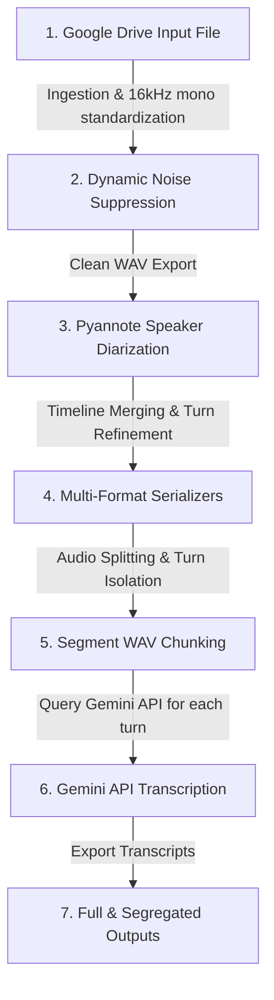

# 🎙️ Gemini API-based Speech Processing & Transcription Pipeline

A production-grade, end-to-end post-processing pipeline notebook ([noise_suppression_diarization_splitting_gemini_api_transcription.ipynb](noise_suppression_diarization_splitting_gemini_api_transcription.ipynb)) that converts raw outreach speech audio files into speaker-attributed transcripts and speaker-segregated outputs using the Gemini API.

---

## 🗺️ Visual Pipeline Flow



---

## Overview

This directory contains the post-processing pipeline which automates:
- **Ingestion & Resampling**: Standardizing raw Google Drive audio to **16kHz mono WAV** (required for optimal Pyannote processing).
- **Dynamic Noise Suppression**: Adaptively filtering non-stationary background noise using `noisereduce` in-memory.
- **Speaker Diarization**: Identifying who spoke when using the **Pyannote 4.x community-1** neural diarization model.
- **Timeline Merging**: Cleaning up the speaker diarization timeline by merging consecutive turns of the same speaker separated by small silence gaps.
- **Audio Splitting & Isolation**: Slicing the denoised audio based on speaker timelines to output speaker-segregated audio files and individual speaker turns.
- **Gemini API Transcription**: Transcribing each speaker turn directly using the **Gemini API** (`gemini-2.5-flash-lite` or similar) by converting in-memory audio slices to WAV bytes.

---

## Features

- **Direct API Transcription**: Eliminates the local GPU VRAM overhead of loading a Whisper-Large model locally by querying the Gemini API.
- **Robust Noise Filtering**: Pre-processes noisy outreach recordings before diarization, significantly improving speaker detection accuracy.
- **Premium Multi-Format Timelines**: Generates TXT, JSON, CSV, standard RTTM, and interactive Markdown reports summarizing speaker participation.
- **Speaker Segregation**: Saves complete transcripts in chronological order and isolates speaker-wise plain text transcripts (`_SPEAKER_XX_transcript.txt`).

---

## Pipeline Structure

```
Pipelines/Noise_Suppression_Diarization_Splitting_Gemini_API/
├── noise_suppression_diarization_splitting_gemini_api_transcription.ipynb  # Gemini API Transcription Pipeline
└── README.md                                                               # This file
```

---

## Installation & Setup

### Prerequisites

- A Google Colab account with a GPU runtime (recommended for fast diarization, though CPU works slowly).
- A Hugging Face account and a Read Access Token (set in Colab Secrets as **`HF_TOKEN`**) with requested and accepted access to [pyannote/speaker-diarization-community-1](https://huggingface.co/pyannote/speaker-diarization-community-1).
- A Gemini API Key (set in Colab Secrets as **`GEMINI_API_KEY`** or supplied in the form parameter).

### Setup

Open [noise_suppression_diarization_splitting_gemini_api_transcription.ipynb](noise_suppression_diarization_splitting_gemini_api_transcription.ipynb) in Google Colab and run Step 0 to install all dependencies:

```bash
# Core dependencies installed in Step 0
!pip install "pyannote.audio>=4.0.1" "noisereduce>=3.0.3" librosa soundfile pandas scipy google-generativeai --prefer-binary
```
*Note: Make sure to restart the session/runtime in Colab after running Step 0.*

---

## Usage & Configuration

Customize the parameter fields in the Colab forms before running the cells:

### 1. Ingestion & Diarization Parameters
- **`input_audio_path`**: Path to your raw audio in Google Drive.
- **`cleaned_audio_folder`**: Drive directory where resampled and denoised audio will be saved.
- **`diarization_output_folder`**: Output directory for CSV, JSON, and RTTM timelines.
- **`num_speakers` / `min_speakers` / `max_speakers`**: Pyannote speaker clustering constraints (set to `0` for auto-estimation).

### 2. Audio Splitting Parameters
- **`isolate_speaker_wise`**: Concatenates all turns of the same speaker into a single `.wav` file (default: `True`).
- **`export_individual_turns`**: Saves each turn as a numbered sequence file (default: `False`).

### 3. API & Transcription Parameters
- **`gemini_api_key`**: Your Gemini API key (optional if set in Colab Secrets).
- **`gemini_model_name`**: The model version used for transcription (default: `gemini-2.5-flash-lite`).
- **`transcription_output_folder`**: Folder where generated transcripts and speaker texts will be saved.

---

## 📝 Example Output Schema

### 1. Diarized Transcript (`_diarized_transcript.json`)
```json
[
  {
    "time": "[00:01 - 00:08]",
    "speaker": "SPEAKER_00",
    "text": "ਸਤਿ ਸ੍ਰੀ ਅਕਾਲ ਜੀ, ਅੱਜ ਅਸੀਂ ਪਿੰਡ ਦੇ ਵਿਕਾਸ ਕਾਰਜਾਂ ਬਾਰੇ ਚਰਚਾ ਕਰਾਂਗੇ।"
  }
]
```

### 2. Chronological Markdown Transcript (`_diarized_transcript.md`)
```markdown
# 🎙️ Diarized Transcript: MarauliKhurad1.m4a

Generated using the Gemini API (gemini-2.5-flash-lite).

> **SPEAKER_00** `[00:01 - 00:08]`  
> ਸਤਿ ਸ੍ਰੀ ਅਕਾਲ ਜੀ, ਅੱਜ ਅਸੀਂ ਪਿੰਡ ਦੇ ਵਿਕਾਸ ਕਾਰਜਾਂ ਬਾਰੇ ਚਰਚਾ ਕਰਾਂਗੇ।
```

### 3. Speaker Segregated Text (`_SPEAKER_00_transcript.txt`)
```text
ਸਤਿ ਸ੍ਰੀ ਅਕਾਲ ਜੀ, ਅੱਜ ਅਸੀਂ ਪਿੰਡ ਦੇ ਵਿਕਾਸ ਕਾਰਜਾਂ ਬਾਰੇ ਚਰਚਾ ਕਰਾਂਗੇ।
```

---

## Key Libraries

- **pyannote.audio**: Deep learning speaker diarization models and clustering pipelines.
- **noisereduce**: Non-stationary noise reduction.
- **google-generativeai**: Gemini SDK for querying model transcription endpoints.
- **librosa & soundfile**: Audio load, resample, and slice export utilities.
