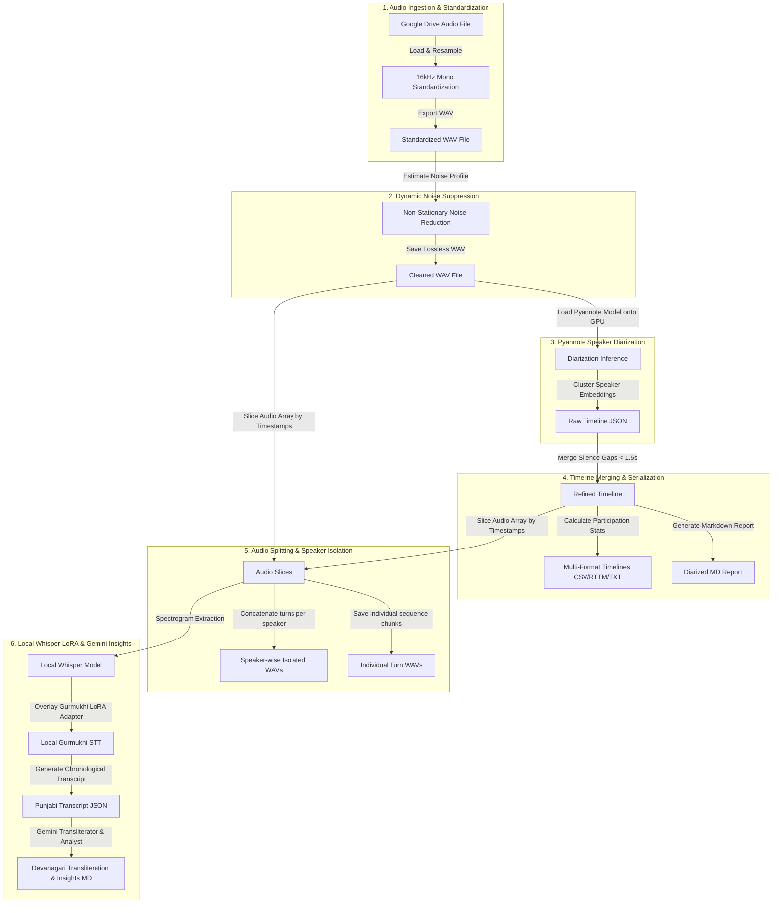

# 🎙️ Unified Noise Suppression, Diarization, Splitting, & Speaker-Wise Local/API Transcription Pipeline


A production-grade, end-to-end speech processing pipeline notebook ([noise_suppression_diarization_splitting_local_whisper_transcription.ipynb](noise_suppression_diarization_splitting_local_whisper_transcription.ipynb)) that converts raw outreach speech audio files into speaker-attributed transcripts, translations, and insights reports.

---

## 🗺️ Visual Pipeline Flow



## Overview

This directory contains the final integrated pipeline which automates:
- **Ingestion & Resampling**: Standardizing raw Google Drive audio to **16kHz mono WAV**.
- **Dynamic Noise Suppression**: Adaptively filtering non-stationary background noise using `noisereduce`.
- **Speaker Diarization**: Running deep-learning-based diarization via the **Pyannote 4.x community-1** engine.
- **Audio Splitting**: Isolating and exporting speaker-wise concatenated audio and individual speech turns.
- **Local Gurmukhi Transcription**: Transcribing Punjabi speaker turns in-memory using a fine-tuned Whisper model (`openai/whisper-large-v3-turbo`) wrapped with LoRA adapters (`Garden2006/whisper-large-v3-turbo-gurmukhi-lora`) locally on GPU.
- **Devanagari Conversion & Insights**: Utilizing the **Gemini API** (`gemini-3.1-flash-lite`) to transliterate transcripts into Devanagari script and extract key insights, questions, and knowledge points.

---

## Features

- **End-to-End Automation**: Ingests raw audio files directly from Google Drive and exports all processed WAVs, timelines, and transcripts back to Drive.
- **Local GPU Transcription**: Leverages local T4 GPU acceleration in Google Colab for Gurmukhi transcription, removing external API dependencies for the base text generation.
- **Parameter-Driven Audio Splitting**: Option to export concatenated speaker audio files as well as individual turn files.
- **Automated Translating & Summarizing**: Transliterates Gurmukhi Punjabi to natural Devanagari script and extracts structured takeaways in a separate insights file.

---

## Pipeline Structure

```
Pipelines/Noise_Suppression_Diarization_Splitting_Local_Whisper_LoRA/
├── noise_suppression_diarization_splitting_local_whisper_transcription.ipynb  # Local GPU Whisper-LoRA + Gemini Insights Pipeline
└── README.md                                                                  # This file
```

---

## Installation & Setup

### Prerequisites

- A Google Colab account with a active **T4 GPU** runtime (*Runtime -> Change runtime type -> T4 GPU*)
- A Hugging Face account and a Read Access Token (set in Colab Secrets as **`HF_TOKEN`**)
- User conditions accepted on HF for [pyannote/speaker-diarization-community-1](https://huggingface.co/pyannote/speaker-diarization-community-1)
- A Gemini API Key (set in Colab Secrets as **`GEMINI_API_KEY`** or supplied in the form)

### Setup

Open the [noise_suppression_diarization_splitting_local_whisper_transcription.ipynb](noise_suppression_diarization_splitting_local_whisper_transcription.ipynb) notebook in Google Colab and run Step 0 to install all dependencies:

```bash
# Core dependencies installed in Step 0
!pip install "pyannote.audio>=4.0.1" "noisereduce>=3.0.3" librosa soundfile pandas scipy google-generativeai transformers peft accelerate --prefer-binary
```
*Note: Make sure to restart the session/runtime in Colab after running Step 0.*

---

## Usage & Configuration

Customize the parameter fields in the Colab forms before running the cells:

### 1. Ingestion & Diarization Parameters
- **`input_audio_path`**: Path to your raw audio in Google Drive.
- **`cleaned_audio_folder`**: Drive directory where resampled and denoised audio will be saved.
- **`diarization_output_folder`**: Output directory for CSV, JSON, and RTTM timelines.
- **`num_speakers` / `min_speakers` / `max_speakers`**: Pyannote speaker clustering constraints (set to `0` for auto-estimation).

### 2. Audio Splitting Parameters
- **`isolate_speaker_wise`**: Concatenates all turns of the same speaker into a single `.wav` file (default: `True`).
- **`export_individual_turns`**: Saves each turn as a numbered sequence file (default: `True`).

### 3. Model Parameters
- **`whisper_base_model`**: The base Whisper architecture (default: `openai/whisper-large-v3-turbo`).
- **`whisper_lora_repo`**: The fine-tuned Gurmukhi Punjabi adapter weights (default: `Garden2006/whisper-large-v3-turbo-gurmukhi-lora`).
- **`gemini_model_name`**: The Gemini version used for transliteration and analysis (default: `gemini-3.1-flash-lite`).

---

## 📝 Example Output Schema

Below is an illustration of how data flows through the transcription and transliteration engine:

### 1. Diarized Gurmukhi Transcript (`_diarized_transcript.json`)
```json
[
  {
    "time": "[00:01 - 00:08]",
    "speaker": "SPEAKER_00",
    "text": "ਤੁਸੀਂ ਕਿਵੇਂ ਹੋ? ਅਸੀਂ ਇੱਥੇ ਪਿੰਡ ਦੀਆਂ ਸਮੱਸਿਆਵਾਂ ਬਾਰੇ ਗੱਲ ਕਰਨ ਆਏ ਹਾਂ।"
  }
]
```

### 2. Devanagari Transcript (`_devanagari_transcript.txt`)
```text
[00:01 - 00:08] SPEAKER_00: तुसीं किवें हो? असीਂ इथे पिंड दीआਂ समस्सिआवां बारे गल्ल करन आए हां।
```

### 3. Key Insights extraction (`_insights_extraction.txt`)
```markdown
### 💡 Key Insights
- The team initiated a community-level discussion regarding rural resource allocation.

### ❓ Questions Raised
- What are the current timelines for pipeline development?
```

---

## 🛠️ Troubleshooting

### 1. `SecretNotFoundError` in Colab
If the cells crash when accessing `HF_TOKEN` or `GEMINI_API_KEY`:
- **Fix**: Open the **Secrets Manager** (key icon 🔑 on the left sidebar in Google Colab), add a new secret named exactly `HF_TOKEN` (or `GEMINI_API_KEY`), paste your token/key, and toggle **Notebook Access** to **ON**.

### 2. Pyannote Pipeline Loading Failure
If the diarization pipeline fails to initialize:
- **Fix**: Ensure your Hugging Face account has requested and been granted access to the community model page at [pyannote/speaker-diarization-community-1](https://huggingface.co/pyannote/speaker-diarization-community-1).

### 3. Out of Memory (OOM) Errors on GPU
If you encounter memory allocation issues while transcribing:
- **Fix**: Make sure you restarted your session after running Step 0 to free up default allocated memory. Ensure no other massive PyTorch models are running concurrently in your background Colab sessions.

---

## Key Libraries

- **pyannote.audio**: Neural speaker diarization models and pipelines
- **noisereduce**: Non-stationary noise reduction algorithms
- **transformers**: Tokenizer, processor, and model loading for Whisper
- **peft**: Parameter-Efficient Fine-Tuning wrapper to load LoRA adapters
- **google-generativeai**: Gemini SDK for Devanagari translation and insight extraction
- **librosa & soundfile**: Audio file resampling and writing

---

## Model Details

### Whisper-Large-v3-Turbo with LoRA
- **Base Model**: `openai/whisper-large-v3-turbo`
- **Fine-tuned Repo**: `Garden2006/whisper-large-v3-turbo-gurmukhi-lora`
- **Target Language**: Punjabi (Gurmukhi script)
- **Framework**: PEFT / LoRA adaptation

### Gemini 3.1 Flash Lite
- **Model**: `gemini-3.1-flash-lite`
- **Application**: Downstream natural language processing, transliteration to Devanagari script, and insights extraction.

---

## Acknowledgments

- **OpenAI**: For the Whisper base speech-to-text model.
- **Pyannote.audio Developers**: For the community-1 diarization pipeline.
- **Hugging Face**: For PEFT/Transformers infrastructure.
- **ANNAM Initiative**: For providing outreach audio datasets.
- **Google Generative AI**: For providing the Gemini LLM platform.

---

- **Pipeline Integration**: Created the unified notebook [noise_suppression_diarization_splitting_local_whisper_transcription.ipynb](noise_suppression_diarization_splitting_local_whisper_transcription.ipynb) containing the entire workflow (Ingestion ➔ Suppression ➔ Diarization ➔ Local Gurmukhi Whisper-LoRA Transcription ➔ Devanagari translation and insights extraction).
- **Completed By**: Kali
- **Date & Time**: June 23, 2026, at 11:59 AM IST
- **Version**: 1.0.0
